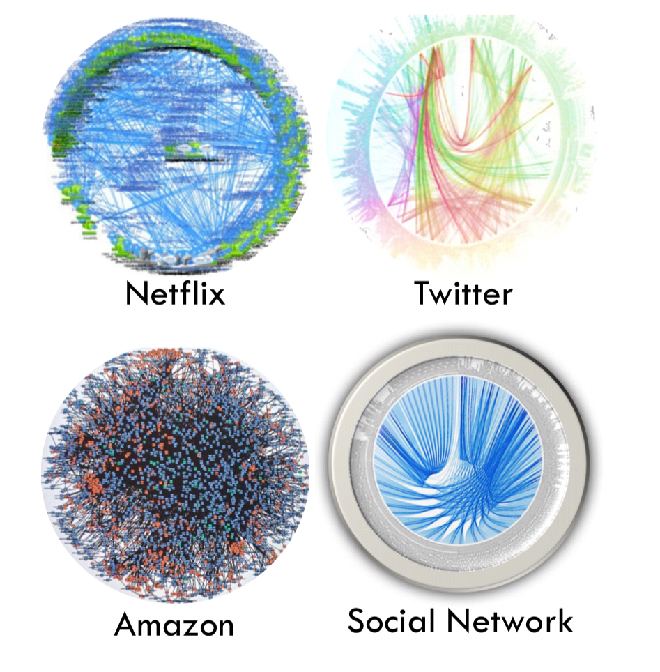

# Service Mesh

Una **service mesh** (malla de servicio) es una capa de infraestructura dedicada a hacer las comunicaciones service-to-service seguras, rápidas y confibles. De esta forma, todo lo referente a las comunicaciones y sus protocolos están fuera de la lógica de negocio.

Si cumples los requisitos para realizar este curso, no te será ajeno desplegar en un clúster de Kubernetes un conjunto de microservicios que compongan una aplicación y tampoco te lo será, para que esta funcione, los microservicos tienen que poder *\"hablar\"* entre sí mediante una red interna.

> A medida que avanzamos hacia la arquitectura de servicios, llevamos la complejidad al espacio que hay entre los servicios.

*Fig. 1: Ejemplo de interconectividad de servicios.*

