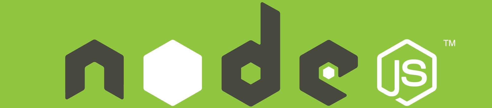

# Presentación

---

> Ahora que lees esto ya te puedes considerar alumno del curso de NodeJS.

Este curso tiene como propósito enseñarte un lenguaje de programación con proyección de futuro. Podrás crear y mejorar tus proyectos y mejorar tus habilidades como desarrollador, programador, administrador, ingeniero, tester, técnico, analista...

Si te digo que NodeJs es JavaScript corriendo en el servidor, no te miento pero me quedo corto, NodeJS es mucho más y te lo demostraré a lo largo del curso.

NodeJS se utiliza hoy en día en una gran variedad de proyectos, y se ha convertido en la mejor elección para el desarrollo de aplicaciones complejas en tiempo real.

Este curso está diseñado para proporcionar al alumno los conocimientos necesarios para programar y ejecutar aplicaciones con una curva de aprendizaje muy suave, con JavaScript del lado del servidor, lo que significa que tras una introducción contextual, empezaremos a aprender los rudimentos de JavaScript para manejarlo con soltura y así ir introduciendo  conceptos más complejos sobre el core de NodeJs. Después profundizaremos en los framewoks más populares y demandados en el desarrollo profesional.

Verás cómo se hace énfasis en la práctica, de modo que podrás afianzar los conocimientos de forma autodidacta y realizar tus propios proyectos a lo largo del mismo.

Tendrás a tu disposición lecciones de JavaScript y de NodeJs, píldoras con información y trucos extra, la guía de la API de NodeJS, proyectos completos para que los analices y repliques, un diccionario y un potente buscador para que encuentres los que buscas.

Tómatelo con calma y muchas gracias por tu tiempo.

頑張って。
